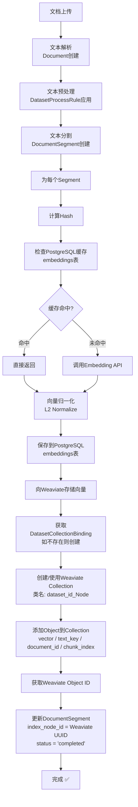

# Dify Embedding 系统架构详解

## 📋 目录

1. [概述](#概述)
2. [PostgreSQL 表结构](#postgresql-表结构)
3. [Embedding 处理流程](#embedding-处理流程)
4. [PostgreSQL 与 Weaviate 的关联](#postgresql-与-weaviate-的关联)
5. [代码实现位置](#代码实现位置)
6. [查询示例](#查询示例)

---

## 概述

Dify 的 embedding 系统架构采用**三层存储策略**：

```
PostgreSQL (元数据 + Embedding缓存)
     ↓
Embedding 模型 (OpenAI/HuggingFace等)
     ↓
Weaviate (向量存储库)
```

**核心特点：**

- ✅ **分布式缓存**：embedding 在 PostgreSQL 缓存，避免重复计算
- ✅ **多模型支持**：支持多个 embedding 提供商和模型
- ✅ **向量库灵活选择**：支持 Weaviate、Qdrant、Milvus 等
- ✅ **完整的元数据追踪**：PostgreSQL 中维护向量库对象的映射关系

---

## PostgreSQL 表结构

### 1. `embeddings` 表 - Embedding 缓存

**用途**：缓存已计算的 embedding 向量，使用文本内容hash作为key，避免重复调用embedding API

**表定义**：

```sql
CREATE TABLE embeddings (
    id UUID PRIMARY KEY,
    model_name VARCHAR(255) NOT NULL DEFAULT 'text-embedding-ada-002',
    hash VARCHAR(64) NOT NULL,              -- SHA256(text_content)
    embedding BYTEA NOT NULL,               -- pickle.dumps(vector)
    provider_name VARCHAR(255) NOT NULL,    -- 'openai', 'huggingface'
    created_at TIMESTAMP DEFAULT CURRENT_TIMESTAMP,

    UNIQUE(model_name, hash, provider_name),
    INDEX idx_created_at (created_at)
);
```

**字段说明**：

| 字段            | 类型      | 说明                     | 示例                                   |
| --------------- | --------- | ------------------------ | -------------------------------------- |
| `id`            | UUID      | 无意义的主键             | `550e8400-e29b-41d4-a716-446655440000` |
| `model_name`    | VARCHAR   | Embedding 模型名         | `text-embedding-ada-002`               |
| `hash`          | VARCHAR   | 文本内容的 SHA256 哈希值 | `a1b2c3d4...`                          |
| `embedding`     | BYTEA     | pickle序列化的浮点向量   | `\x8003...`                            |
| `provider_name` | VARCHAR   | embedding 模型提供商     | `openai`                               |
| `created_at`    | TIMESTAMP | 创建时间                 | `2024-01-01 10:00:00`                  |

**关键特性**：

- 使用 **唯一约束** `(model_name, hash, provider_name)` 确保不重复缓存
- embedding 向量使用 **pickle 二进制格式** 存储（Python native格式）
- 通过 hash 快速查找，O(1) 时间复杂度

**缓存示例**：

```python
# 同一文本，同一模型，只缓存一次
text = "The quick brown fox"
hash = sha256(text)  # 相同的hash
# 第一次：miss → 调用API → 保存到embeddings表
# 第二次：hit → 直接返回缓存
```

---

### 2. `dataset_collection_bindings` 表 - Embedding模型与向量库的映射

**用途**：建立 embedding 模型和 Weaviate 集合的对应关系。每个 (provider, model) 对应 Weaviate 中的一个 collection

**表定义**：

```sql
CREATE TABLE dataset_collection_bindings (
    id UUID PRIMARY KEY,
    provider_name VARCHAR(255) NOT NULL,    -- 'openai'
    model_name VARCHAR(255) NOT NULL,       -- 'text-embedding-ada-002'
    collection_name VARCHAR(64) NOT NULL,   -- Weaviate 中的 collection 名
    type VARCHAR(40) NOT NULL DEFAULT 'dataset',  -- CollectionBindingType
    created_at TIMESTAMP DEFAULT CURRENT_TIMESTAMP,

    INDEX idx_provider_model (provider_name, model_name)
);
```

**字段说明**：

| 字段              | 类型      | 说明                | 示例                                   |
| ----------------- | --------- | ------------------- | -------------------------------------- |
| `id`              | UUID      | 主键                | `550e8400-e29b-41d4-a716-446655440000` |
| `provider_name`   | VARCHAR   | embedding 提供商    | `openai`                               |
| `model_name`      | VARCHAR   | embedding 模型名    | `text-embedding-ada-002`               |
| `collection_name` | VARCHAR   | Weaviate 中的集合名 | `c_55003000_xxxxxxx_Node`              |
| `type`            | VARCHAR   | 绑定类型            | `dataset`                              |
| `created_at`      | TIMESTAMP | 创建时间            | `2024-01-01 10:00:00`                  |

**一对多关系**：

```
一个Dataset可能使用多个embedding模型：
Dataset A
├─ embedding_model_provider: openai
├─ embedding_model: text-embedding-ada-002
│  └─ collection_binding → collection_name: c_xxxx_Node (在Weaviate中)
│
└─ 如果切换模型，会创建新的DatasetCollectionBinding
   └─ embedding_model: text-embedding-3-large
      └─ collection_binding → collection_name: c_yyyy_Node (新的Weaviate集合)
```

---

### 3. `document_segments` 表 - 文档分块与向量库的关联

**用途**：存储文档的拆分片段，每个片段对应 Weaviate 中的一个向量对象。这是 PostgreSQL 和 Weaviate 的关键关联表

**表定义**：

```sql
CREATE TABLE document_segments (
    id UUID PRIMARY KEY,
    tenant_id UUID NOT NULL,
    dataset_id UUID NOT NULL,
    document_id UUID NOT NULL,
    position INTEGER NOT NULL,              -- 片段在文档中的顺序
    content LONGTEXT NOT NULL,              -- 片段的实际文本内容
    answer LONGTEXT,                        -- 可选的答案/补充内容
    word_count INTEGER NOT NULL,            -- 单词数
    tokens INTEGER NOT NULL,                -- LLM token数

    -- Weaviate 关联字段 (最重要!)
    index_node_id VARCHAR(255),             -- Weaviate 中该对象的 UUID
    index_node_hash VARCHAR(255),           -- 节点内容的哈希值

    -- 状态和统计
    keywords JSON,                          -- 提取的关键词
    hit_count INTEGER DEFAULT 0,            -- 被检索的次数
    enabled BOOLEAN DEFAULT TRUE,
    status VARCHAR(255) DEFAULT 'waiting',  -- 'waiting'/'completed'/'error'

    created_by UUID,
    created_at TIMESTAMP DEFAULT CURRENT_TIMESTAMP,
    updated_at TIMESTAMP DEFAULT CURRENT_TIMESTAMP,
    completed_at TIMESTAMP,

    PRIMARY KEY (id),
    INDEX idx_dataset_id (dataset_id),
    INDEX idx_document_id (document_id),
    INDEX idx_node_dataset (index_node_id, dataset_id),  -- 快速查找
    INDEX idx_status (status)
);
```

**字段说明**：

| 字段                | 类型     | 说明                        | 示例                                   |
| ------------------- | -------- | --------------------------- | -------------------------------------- |
| `id`                | UUID     | 分块唯一ID                  | `550e8400-e29b-41d4-a716-446655440000` |
| `dataset_id`        | UUID     | 所属知识库                  | `e29b-41d4...`                         |
| `document_id`       | UUID     | 所属文档                    | `a716-446655...`                       |
| `position`          | INTEGER  | 分块在文档中的位置          | `0, 1, 2, ...`                         |
| `content`           | LONGTEXT | 分块的全部文本              | `"This is the chunk text..."`          |
| `word_count`        | INTEGER  | 文本单词数                  | `150`                                  |
| `tokens`            | INTEGER  | LLM token数                 | `200`                                  |
| **`index_node_id`** | VARCHAR  | **Weaviate 对象ID (关键!)** | `550e8400-e29b-41d4-a716-446655440000` |
| `index_node_hash`   | VARCHAR  | 内容哈希值                  | `a1b2c3d4...`                          |
| `status`            | VARCHAR  | 处理状态                    | `completed`, `waiting`, `error`        |
| `hit_count`         | INTEGER  | 被检索的次数（用于排序）    | `5`                                    |

**重要关联说明**：

```python
# index_node_id 是关键！它指向 Weaviate 中的对象 UUID
# PostgreSQL 中一条 DocumentSegment 记录 <-> Weaviate 中一个 Object

# 查询流程示例：
segment = db.session.get(DocumentSegment, segment_id)
weaviate_object_id = segment.index_node_id
# 通过此ID可以在Weaviate中查询到对应的向量对象
```

---

### 4. `datasets` 表 - Embedding 相关字段

**表定义（仅列出 embedding 相关字段）**：

```sql
CREATE TABLE datasets (
    id UUID PRIMARY KEY,
    tenant_id UUID NOT NULL,
    name VARCHAR(255),
    description LONGTEXT,

    -- Embedding 配置字段
    embedding_model VARCHAR(255),           -- 例如: "text-embedding-ada-002"
    embedding_model_provider VARCHAR(255),  -- 例如: "openai"
    collection_binding_id UUID,             -- 外键到 dataset_collection_bindings

    -- 向量库完整配置
    index_struct LONGTEXT,                  -- JSON 格式，示例见下文

    -- 其他字段...
    retrieval_model JSON,                   -- 检索配置
    built_in_field_enabled BOOLEAN,
    is_multimodal BOOLEAN,

    created_by UUID,
    created_at TIMESTAMP,
    updated_at TIMESTAMP,

    INDEX idx_tenant (tenant_id)
);
```

**`index_struct` JSON 结构示例**：

```json
{
  "type": "weaviate",
  "vector_store": {
    "class_prefix": "c_550e8400_e29b_Node"
  }
}
```

**字段说明**：

| 字段                       | 类型    | 说明              | 示例                        |
| -------------------------- | ------- | ----------------- | --------------------------- |
| `embedding_model`          | VARCHAR | embedding 模型名  | `text-embedding-ada-002`    |
| `embedding_model_provider` | VARCHAR | embedding 提供商  | `openai`                    |
| `collection_binding_id`    | UUID    | 外键关联          | `550e8400-e29b...`          |
| `index_struct`             | JSON    | Weaviate 配置信息 | `{"type": "weaviate", ...}` |

---

## Embedding 处理流程

### 核心流程图



### 代码实现

**Embedding 缓存与获取**：[api/core/rag/embedding/cached_embedding.py](../api/core/rag/embedding/cached_embedding.py)

```python
class CacheEmbedding(Embeddings):
    def embed_documents(self, texts: list[str]) -> list[list[float]]:
        text_embeddings = [None] * len(texts)
        embedding_queue_indices = []

        # 第一步：检查缓存
        for i, text in enumerate(texts):
            hash = helper.generate_text_hash(text)
            embedding = db.session.scalar(
                select(Embedding).where(
                    Embedding.model_name == self._model_instance.model_name,
                    Embedding.hash == hash,
                    Embedding.provider_name == self._model_instance.provider,
                )
            )
            if embedding:
                text_embeddings[i] = embedding.get_embedding()  # 缓存命中
            else:
                embedding_queue_indices.append(i)  # 需要调用API

        # 第二步：调用API获取缺失的embeddings
        if embedding_queue_indices:
            # ... 调用embedding模型 ...
            embedding_result = self._model_instance.invoke_text_embedding(texts=batch_texts)

            # 第三步：向量规范化和缓存保存
            for vector in embedding_result.embeddings:
                normalized = vector / np.linalg.norm(vector)  # L2 normalize
                embedding_cache = Embedding(
                    model_name=self._model_instance.model_name,
                    hash=hash,
                    embedding=pickle.dumps(normalized, protocol=pickle.HIGHEST_PROTOCOL)
                )
                db.session.add(embedding_cache)

        db.session.commit()
        return text_embeddings
```

**Embedding 模型**：[api/models/dataset.py](../api/models/dataset.py)

```python
class Embedding(Base):
    __tablename__ = "embeddings"

    model_name: Mapped[str] = mapped_column(String(255), default='text-embedding-ada-002')
    hash: Mapped[str] = mapped_column(String(64))
    embedding: Mapped[bytes] = mapped_column(BYTEA)
    provider_name: Mapped[str] = mapped_column(String(255))
    created_at: Mapped[datetime] = mapped_column(DateTime, server_default=func.current_timestamp())

    def get_embedding(self) -> list[float]:
        """反序列化pickle格式的向量"""
        return cast(list[float], pickle.loads(self.embedding))
```

---

## PostgreSQL 与 Weaviate 的关联

### 关联模型

```
PostgreSQL                              Weaviate
================================================================
DocumentSegment:
  ├─ id: "seg-001"
  ├─ content: "The story begins..."
  ├─ document_id: "doc-001"
  └─ index_node_id: "uuid-xxx-yyy" ──> Object("uuid-xxx-yyy"):
                                         ├─ text_key: "The story begins..."
                                         ├─ document_id: "doc-001"
                                         ├─ chunk_index: 0
                                         └─ embedding: [0.1, 0.2, 0.3, ...]
```

### 重要关系

1. **一对一映射**：每个 `DocumentSegment` 对应 Weaviate 中的一个 Object
   - PostgreSQL 中保存 `index_node_id` = Weaviate Object 的 UUID
   - 用于反向查询：Weaviate 搜索结果 → PostgreSQL 原始数据

2. **多对一关系**：多个 DocumentSegment 属于同一个 Collection
   - 所有属于同一 Dataset 的 Segments 存储在同一个 Weaviate Collection 中
   - Collection 名称由 `dataset_collection_bindings.collection_name` 指定

3. **Embedding 模型一致性**
   - 同一 Dataset 中 embedding 时使用的模型必须一致
   - 由 `dataset.embedding_model` 和 `dataset.embedding_model_provider` 指定

---

## 代码实现位置

### 核心模块

| 功能           | 文件位置                                                                                                              | 说明                                             |
| -------------- | --------------------------------------------------------------------------------------------------------------------- | ------------------------------------------------ |
| Embedding 缓存 | [api/core/rag/embedding/cached_embedding.py](../api/core/rag/embedding/cached_embedding.py)                           | 实现缓存逻辑、API调用、向量保存                  |
| Weaviate 集成  | [api/core/rag/datasource/vdb/weaviate/weaviate_vector.py](../api/core/rag/datasource/vdb/weaviate/weaviate_vector.py) | 向量库的增删改查                                 |
| 数据库模型     | [api/models/dataset.py](../api/models/dataset.py)                                                                     | PostgreSQL 表定义 (Embedding, DocumentSegment等) |
| 向量库工厂     | [api/core/rag/datasource/vdb/vector_factory.py](../api/core/rag/datasource/vdb/vector_factory.py)                     | 支持多种向量库的抽象工厂                         |
| Weaviate 配置  | [api/configs/middleware/vdb/weaviate_config.py](../api/configs/middleware/vdb/weaviate_config.py)                     | Weaviate 连接配置                                |

### Embedding 处理相关任务

| 任务     | 文件位置                                                                | 说明                          |
| -------- | ----------------------------------------------------------------------- | ----------------------------- |
| 文档索引 | [api/services/document_service.py](../api/services/document_service.py) | 协调整个文档处理流程          |
| 分段处理 | `api/tasks/`                                                            | Celery 任务：清洁、分割、索引 |
| 向量搜索 | [api/core/rag/retriever/](../api/core/rag/retriever/)                   | RAG 检索的核心逻辑            |

---

## 查询示例

### 1. 查询文档中的所有 Segments

```python
from models.dataset import DocumentSegment

segments = db.session.scalars(
    select(DocumentSegment)
    .where(DocumentSegment.document_id == doc_id)
    .order_by(DocumentSegment.position)
).all()

for segment in segments:
    print(f"ID: {segment.id}")
    print(f"Weaviate ID: {segment.index_node_id}")
    print(f"Content: {segment.content[:100]}")
    print(f"Status: {segment.status}")
```

### 2. 查询 Embedding 缓存

```python
from models.dataset import Embedding
import hashlib

text = "Some text to embed"
text_hash = hashlib.sha256(text.encode()).hexdigest()

embedding = db.session.scalar(
    select(Embedding).where(
        Embedding.model_name == "text-embedding-ada-002",
        Embedding.hash == text_hash,
        Embedding.provider_name == "openai"
    )
)

if embedding:
    vector = embedding.get_embedding()  # 反序列化
    print(f"Vector dimension: {len(vector)}")
    print(f"First 10 values: {vector[:10]}")
```

### 3. 获取 Dataset 的 Embedding 配置

```python
from models.dataset import Dataset, DatasetCollectionBinding

dataset = db.session.get(Dataset, dataset_id)

print(f"Embedding Model: {dataset.embedding_model}")
print(f"Provider: {dataset.embedding_model_provider}")

# 获取对应的 Weaviate Collection 信息
binding = db.session.get(
    DatasetCollectionBinding,
    dataset.collection_binding_id
)

if binding:
    print(f"Weaviate Collection: {binding.collection_name}")
    print(f"Index Structure: {dataset.index_struct}")
```

### 4. SQL 查询统计索引状态

```sql
-- 统计各数据集的 embedding 完成情况
SELECT
    ds.id,
    ds.name,
    ds.embedding_model,
    COUNT(seg.id) as total_segments,
    SUM(CASE WHEN seg.status = 'completed' THEN 1 ELSE 0 END) as completed_segments,
    SUM(CASE WHEN seg.status = 'error' THEN 1 ELSE 0 END) as error_segments,
    SUM(seg.hit_count) as total_hits
FROM datasets ds
LEFT JOIN document_segments seg ON ds.id = seg.dataset_id
GROUP BY ds.id, ds.name, ds.embedding_model;

-- 查询缓存命中率
SELECT
    model_name,
    provider_name,
    COUNT(*) as total_cached_embeddings,
    COUNT(DISTINCT hash) as unique_texts
FROM embeddings
GROUP BY model_name, provider_name;
```

---

## 配置说明

### 环境变量

```bash
# Weaviate 连接配置
WEAVIATE_ENDPOINT=http://weaviate:8080
WEAVIATE_API_KEY=your-api-key
WEAVIATE_GRPC_ENDPOINT=grpc://weaviate:50051
WEAVIATE_BATCH_SIZE=100

# 向量库选择
VECTOR_STORE=weaviate  # 可选: qdrant, milvus, chroma, pinecone等
VECTOR_INDEX_NAME_PREFIX=c_  # Weaviate collection名前缀

# Embedding 模型配置（通过UI或API设置）
# EMBEDDING_MODEL=text-embedding-ada-002
# EMBEDDING_PROVIDER=openai
```

---

## 总结

| 层次     | 储存介质                         | 内容                                    | 用途                               |
| -------- | -------------------------------- | --------------------------------------- | ---------------------------------- |
| 缓存层   | PostgreSQL (embeddings表)        | 文本hash → 向量                         | 避免重复调用API，加速embedding生成 |
| 元数据层 | PostgreSQL (document_segments表) | 原始文本 + Weaviate UUID                | 维护向量库对象的映射，支持反向查询 |
| 向量层   | Weaviate (Collections)           | 向量 + 属性                             | 高效的向量相似度搜索               |
| 配置层   | PostgreSQL (datasets表)          | embedding模型、provider、collection映射 | 支持多模型、灵活切换               |

这个架构设计的优势：

- ✅ **高效的缓存**：避免重复embedding计算
- ✅ **灵活的多模型支持**：可以为不同dataset使用不同的embedding模型
- ✅ **完整的数据追踪**：PostgreSQL中保存对应的原始数据和向量库ID
- ✅ **高性能搜索**：利用Weaviate的向量搜索能力
- ✅ **容错恢复**：可以通过index_node_id关联两边数据，支持数据同步和修复
