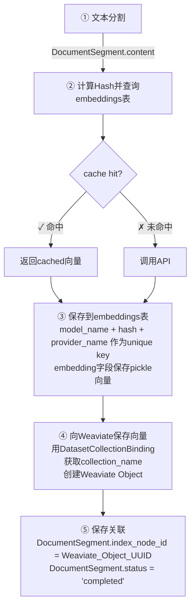

# Dify Embedding 系统 - 快速参考卡

## 🔑 核心三张表

### 1️⃣ `embeddings` - Embedding 缓存

```
存储已计算的向量，避免重复调用API

关键字段:
  • model_name (VARCHAR) - embedding模型名
  • hash (VARCHAR) - 文本SHA256哈希（查询key）
  • embedding (BYTEA) - pickle序列化的向量 [0.1, 0.2, ...]
  • provider_name (VARCHAR) - 提供商 (openai/huggingface)

约束:
  UNIQUE(model_name, hash, provider_name)

使用场景:
  SELECT * FROM embeddings
  WHERE hash = '${sha256(text)}'
  AND model_name = 'text-embedding-ada-002'
  AND provider_name = 'openai'
```

### 2️⃣ `document_segments` - 分块与向量库关联

```
文档分块与Weaviate向量对象的映射表（最重要的中间表）

关键字段:
  • id (UUID) - 分块唯一ID
  • document_id (UUID) - 所属文档
  • content (LONGTEXT) - 分块文本内容

  ⭐ index_node_id (VARCHAR) - Weaviate对象UUID（关键关联字段！）
  ⭐ status (VARCHAR) - 'waiting'|'completed'|'error'

  • position (INT) - 文档中的顺序
  • hit_count (INT) - 被检索次数统计

索引:
  KEY (index_node_id, dataset_id)  -- 快速查找

作用:
  PostgreSQL记录 ←→ Weaviate对象
  通过index_node_id建立双向映射
```

### 3️⃣ `dataset_collection_bindings` - 模型与集合映射

```
Embedding模型与Weaviate集合的对应关系

关键字段:
  • provider_name (VARCHAR) - 提供商
  • model_name (VARCHAR) - 模型名
  • collection_name (VARCHAR) - Weaviate集合名

  示例:
  provider='openai', model='ada-002' → collection='c_xxxxx_Node'
  provider='huggingface', model='bge' → collection='c_yyyyy_Node'
```

---

## 🔄 Embedding 流程简化版



---

## 🎯 关键字段对应关系

| PostgreSQL                                    | Weaviate           | 说明                |
| --------------------------------------------- | ------------------ | ------------------- |
| `embeddings.hash`                             | N/A                | 缓存的唯一key       |
| `embeddings.embedding`                        | Object.vector      | 向量本体            |
| `document_segments.content`                   | Object.text_key    | 文本内容            |
| `document_segments.index_node_id`             | Object.id          | **关联ID(最重要!)** |
| `document_segments.document_id`               | Object.document_id | 文档ID属性          |
| `dataset_collection_bindings.collection_name` | Collection.name    | 集合名              |

---

## 🔍 常用查询

### 查询方式① 从PostgreSQL查向量

```python
from models.dataset import Embedding

# 方式A: 通过hash查询
hash = hashlib.sha256("text content".encode()).hexdigest()
emb = db.session.scalar(
    select(Embedding).where(
        Embedding.hash == hash,
        Embedding.model_name == "text-embedding-ada-002",
        Embedding.provider_name == "openai"
    )
)
vector = emb.get_embedding() if emb else None

# 方式B: 反序列化
import pickle
vector = pickle.loads(emb.embedding)
```

### 查询方式② 找到对应的Weaviate对象

```python
from models.dataset import DocumentSegment

segments = db.session.scalars(
    select(DocumentSegment).where(
        DocumentSegment.dataset_id == dataset_id,
        DocumentSegment.status == 'completed'
    )
).all()

for seg in segments:
    weaviate_id = seg.index_node_id  # 用这个ID在Weaviate查询
    print(f"Weaviate对象ID: {weaviate_id}")
```

### 查询方式③ Weaviate搜索后回表PostgreSQL

```python
# Weaviate返回结果中包含index_node_id
# 然后反查PostgreSQL获取完整信息

segment = db.session.scalar(
    select(DocumentSegment).where(
        DocumentSegment.index_node_id == weaviate_object_id
    )
)
# 获得原始文本、元数据等
```

---

## 📊 数据量参考

```
假设有以下场景:
- 10个Dataset
- 100个Document
- 1000个DocumentSegment (文本分块)

PostgreSQL存储:
• embeddings表: ~500行 (同一模型的重复文本去重后)
• document_segments表: 1000行
• dataset_collection_bindings表: 10行

Weaviate存储:
• Collections: 10个 (每个dataset一个)
• Objects: 1000个 (每个segment一个)
• Vectors: 1000个 (768维或1536维)

存储空间:
• embeddings表: ~500 * (255 + 64 + 4096 bytes) ≈ 2GB
• document_segments表: ~1000 * (900 bytes) ≈ 900MB
• Weaviate: ~1000 * (1536维 * 4字节) ≈ 6GB
```

---

## ⚡ 性能优化点

### 1. Embedding缓存命中率

```sql
-- 计算缓存命中率
SELECT
    (COUNT(DISTINCT hash) * 100.0 / COUNT(*)) as cache_hit_ratio
FROM embeddings
GROUP BY model_name;
-- 目标: > 80% (避免重复计算)
```

### 2. 索引优化

```sql
-- 最常用的查询
CREATE INDEX idx_seg_node_dataset ON document_segments(index_node_id, dataset_id);
CREATE INDEX idx_emb_model_hash ON embeddings(model_name, hash);
```

### 3. Batch处理

```python
# ✗ 错误: 逐个embedding调用API
for text in texts:
    embed(text)

# ✓ 正确: 批量处理，利用缓存
embeddings = CacheEmbedding(model_instance)
vectors = embeddings.embed_documents(texts)  # 批量查询缓存 + API
```

---

## 🐛 常见问题排查

### Q1: 向量库和PostgreSQL数据不同步？

**原因**: `index_node_id` 为 NULL 或不存在对应的Weaviate对象

**排查**:

```sql
-- 找出没有同步的segments
SELECT * FROM document_segments
WHERE index_node_id IS NULL AND status = 'completed';

-- 重新索引这些segments
UPDATE document_segments SET status = 'waiting' WHERE index_node_id IS NULL;
```

### Q2: embedding计算变慢？

**原因**: Embedding缓存未命中，重复调用API

**排查**:

```sql
-- 查看缓存表
SELECT COUNT(*) total, COUNT(DISTINCT hash) unique_texts
FROM embeddings
WHERE model_name = 'text-embedding-ada-002';
-- unique_texts应该接近total，否则有重复

-- 查看命中情况
EXPLAIN ANALYZE
SELECT * FROM embeddings
WHERE hash = '...' AND model_name = '...'
-- 应该走索引，速度 < 1ms
```

### Q3: Weaviate集合创建失败？

**排查**:

```python
# 检查DatasetCollectionBinding
binding = db.session.scalar(
    select(DatasetCollectionBinding).where(
        DatasetCollectionBinding.collection_name == 'expected_collection_name'
    )
)

# 检查collection_name格式
# 应该为: c_{dataset_id}_Node
# 例如: c_550e8400_e29b_Node
```

---

## 📚 代码位置快速导航

```
Embedding处理流程:
├─ api/core/rag/embedding/
│  ├─ cached_embedding.py ⭐ 缓存逻辑的核心
│  └─ embedding_base.py - 基类定义
│
├─ api/models/dataset.py ⭐ 表定义
│  ├─ class Embedding
│  ├─ class DocumentSegment
│  └─ class DatasetCollectionBinding
│
└─ api/core/rag/datasource/vdb/
   ├─ weaviate/weaviate_vector.py - Weaviate集成
   └─ vector_factory.py - 向量库工厂模式
```

---

## 💾 备份和迁移

### 导出Embedding缓存

```sql
-- 导出为CSV
COPY embeddings(id, model_name, hash, provider_name, created_at)
TO '/tmp/embeddings.csv' WITH CSV;

-- 导出embedding向量（用于备份）
SELECT id, model_name, hash,
       length(embedding) as vector_size,
       provider_name, created_at
FROM embeddings
ORDER BY created_at DESC
LIMIT 1000;
```

### 重新计算embedding

```python
# 如果需要更换模型，重新计算所有embeddings
from models.dataset import DocumentSegment
from core.rag.embedding.cached_embedding import CacheEmbedding

segments = db.session.scalars(
    select(DocumentSegment).where(
        DocumentSegment.dataset_id == dataset_id
    )
).all()

texts = [seg.content for seg in segments]

# 使用新模型
cache_embedding = CacheEmbedding(new_model_instance)
new_vectors = cache_embedding.embed_documents(texts)

# 更新DocumentSegment.status重新索引
for seg in segments:
    seg.status = 'waiting'
db.session.commit()
```

---

## 🎓 架构特点总结

| 特点           | 具体实现                                                              |
| -------------- | --------------------------------------------------------------------- |
| **缓存机制**   | embeddings表通过(model_name, hash, provider_name)唯一约束实现全局去重 |
| **多模型支持** | dataset_collection_bindings支持多个(provider, model)组合              |
| **数据完整性** | document_segments.index_node_id维护PostgreSQL和Weaviate的映射关系     |
| **搜索效率**   | Weaviate向量搜索 + PostgreSQL元数据查询的混合方案                     |
| **容错能力**   | 可通过index_node_id双向查找和同步数据                                 |
